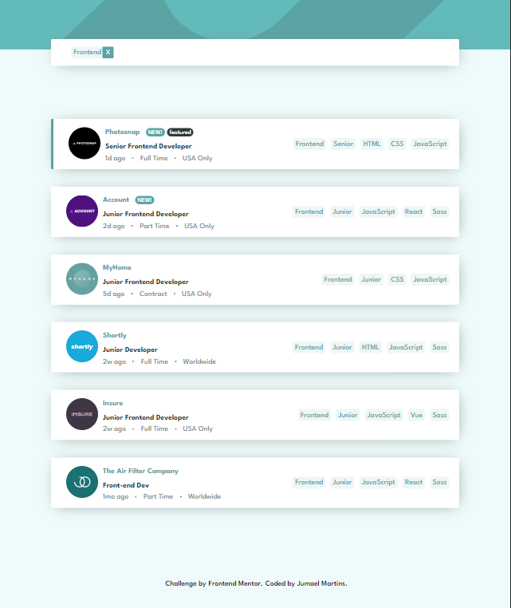
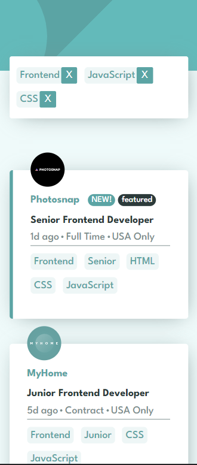

# Frontend Mentor - Job listings with filtering solution

Essa é minha solução para o desafio do site Frontend Mentor [Job listings with filtering challenge on Frontend Mentor](https://www.frontendmentor.io/challenges/job-listings-with-filtering-ivstIPCt). 

## Table of contents

- [Overview](#overview)
  - [The challenge](#the-challenge)
  - [Screenshot](#screenshot)
  - [Links](#links)
- [My process](#my-process)
  - [Built with](#built-with)
  - [What I learned](#what-i-learned)
  - [Continued development](#continued-development)
  - [Useful resources](#useful-resources)
- [Author](#author)
- [Acknowledgments](#acknowledgments)

## Overview

### The challenge

Criar um pagina com uma lista de empregos o mais parecido possivel com o design fornecido, os dados vem de um arquivo JSON fornecido no desafio.

Usuarios Poderão:

- Ter a melhor visualização do conteudo de acordo com a resolução de seus dispositivos.
- Ver efeitos de hover ao interagir com elementos que tenha status ativo
- Filtrar os empregos de acordo as categorias selecionadas. ao clicar na label no canto direito de cada card no desktop, e na parte inferior do card no mobile.
    As categorias são:
    - Role: Frontend, Backend, Fullstack
    - Level: Junior, Midweight, Senior
    - Languages: Python, Ruby, JavaScript, HTML, CSS
    - Tools: React, Sass, Vue, Django, RoR (Ruby on Rails)

### Screenshot

### Preview Desktop


### Preview Mobile


### Links

- Solution URL: [https://github.com/jumaelmartins/Frontend-Mentor-Job-listings-with-filtering-solution](https://github.com/jumaelmartins/Frontend-Mentor-Job-listings-with-filtering-solution)
- Live Site URL: [https://frontend-mentor-job-listings-with-filtering-solution.vercel.app/](https://frontend-mentor-job-listings-with-filtering-solution.vercel.app/)

## My process

### Built with

- Marcação de HTML Semantico
- Fluxo de Trabalho Mobile-first
- Flexbox
- [SCSS](https://sass-lang.com/guide) - Pre-Processador de CSS
- [Vite](https://vitejs.dev/guide/) - Build do Projeto

### What I learned

Neste projeto consegui, entender um pouco mais como tratar dados vindos de uma promisse e exibilos na tela, e tambem a aplicat filtros em Array.

```js
// função utilizada para realizar o filtro multiplo.

const filterItens = () => {
  const categories = document.querySelectorAll("li > [class=categories]");

  categories.forEach((iten) => {
    const filteredIten = filter.every((value) =>
      iten.textContent.includes(value)
    );
    if (!filteredIten) iten.parentNode.classList.add("hidden");
  });
};
```
### Continued development

- Pretendo dar continuidade nos estudos de metodos de Arrays para filtragem de dados e manipulação de DOM até me sentir mais confortavel em fazer essas coisas.

### Useful resources

- [https://chat.openai.com/chat](https://chat.openai.com/chat) - Me ajudou a esclarecer algumas duvidas sobre methodos e funções de arrays
- [https://developer.mozilla.org/en-US/docs/Web/JavaScript/Reference/Global_Objects/Array/every](https://developer.mozilla.org/en-US/docs/Web/JavaScript/Reference/Global_Objects/Array/every) - Me ajudou na parte do Filtro Multiplo essa função.


## Author

- Portifolio - [Portifolio_JumaelMartins](https://portfolio-jumaelmartins.vercel.app/)
- Linkedin - [@jumael-martins](https://www.linkedin.com/in/jumael-martins/)
- GitHub - [@jumaelmartins](https://github.com/jumaelmartins)
- Frontend Mentor - [@jumaelmartins](https://www.frontendmentor.io/profile/jumaelmartins)


## Acknowledgments

Deixo um agradecimento especial ao Ulisses Silvério [@Odisseu93](https://github.com/Odisseu93) me ajudou a montar a logica para desenvolver o filtro multiplo.